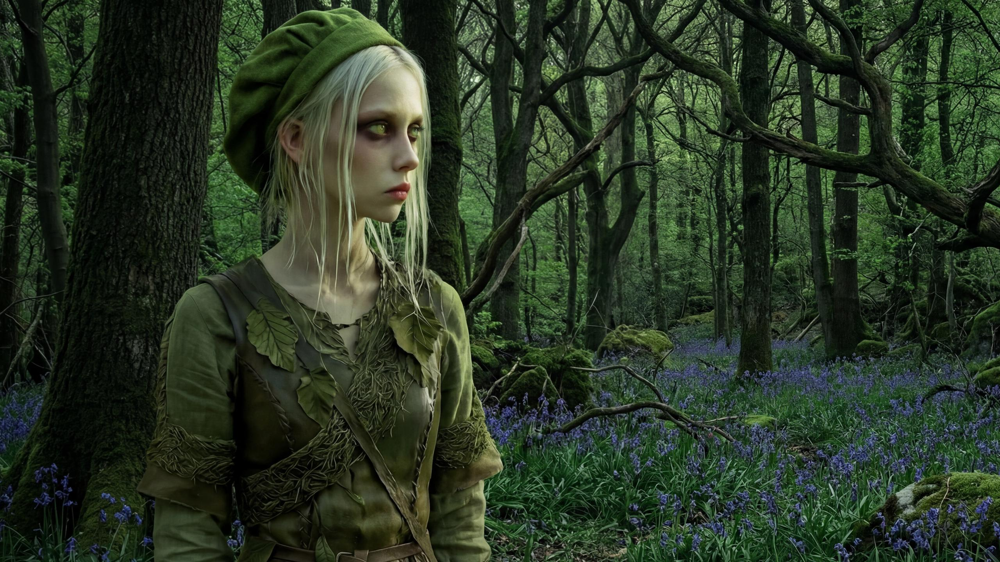
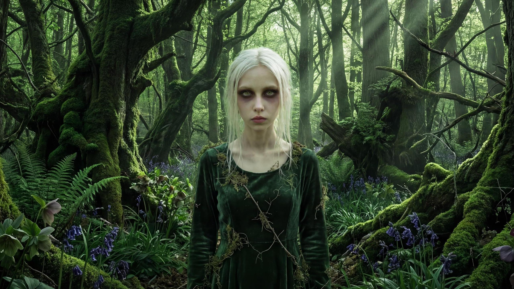
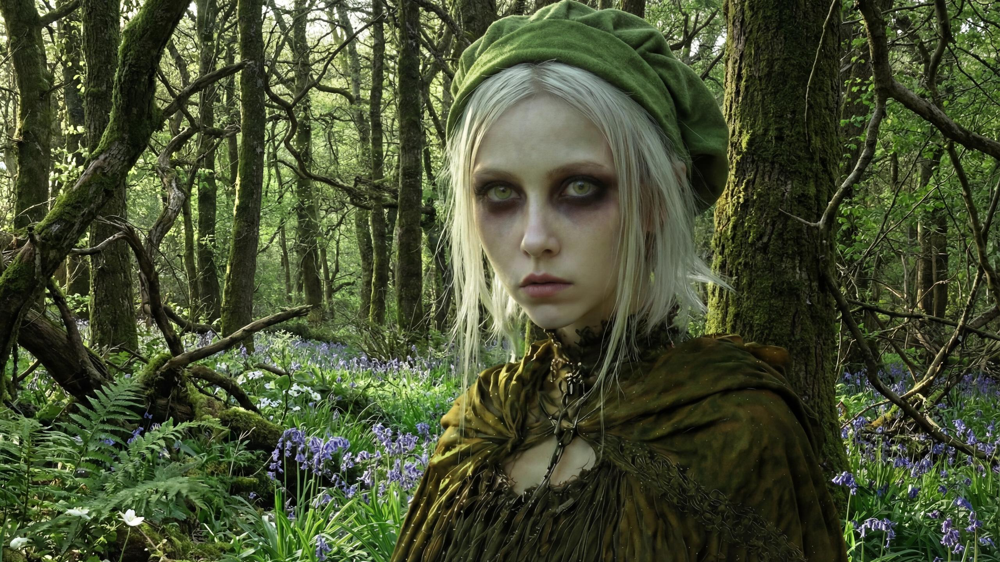
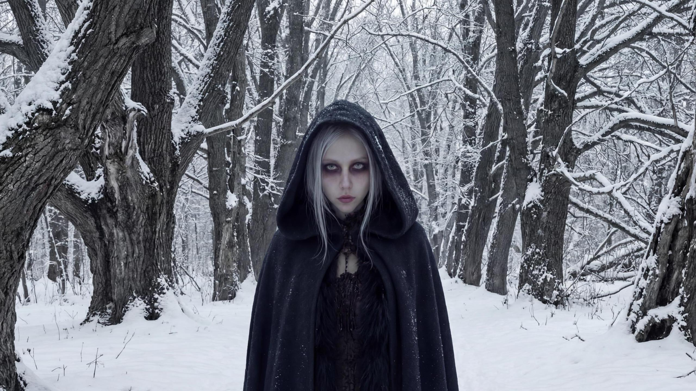
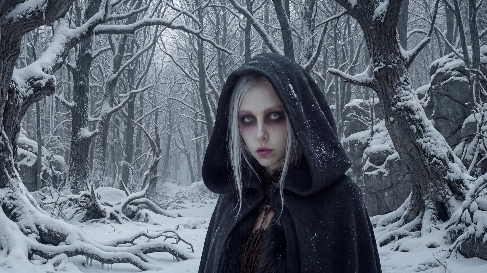

# Wallpapers

Wallpaper assets + per-set configuration consumed by `nix-season-wallpaper`.

## Layout

- `wallpapers/widescreen/`: ultrawide JPEGs.
- `wallpapers/normal/`: 16:9-cropped JPEGs.

## Gallery

  
  
  

  
  
  

  
  
  

  
  
  

## Config

- `config/seasons.json`: festival definitions per season (names/dates; festival name becomes part of the wallpaper key like `winter_<festival>`).
- `config/defaults.json`: global defaults:
  - `festivalPadding.before` / `festivalPadding.after`: extend festival windows by N days.
  - `numberedPositions`: default crop positions for numbered wallpapers by count.
- `config/positions.json`: per-wallpaper override for crop position (`left`/`center`/`right`) keyed by wallpaper key.
- `config/styles.json`: season -> style string to expose in resolver metadata.

## License

- Wallpaper images and configuration (`wallpapers/`, `wallpapers-raw/`, `config/`) are licensed under CC0 1.0 Universal (see `LICENSE-CC0`).
- Scripts and other code (for example `scripts/`) are licensed under the MIT License (see `LICENSE`).
